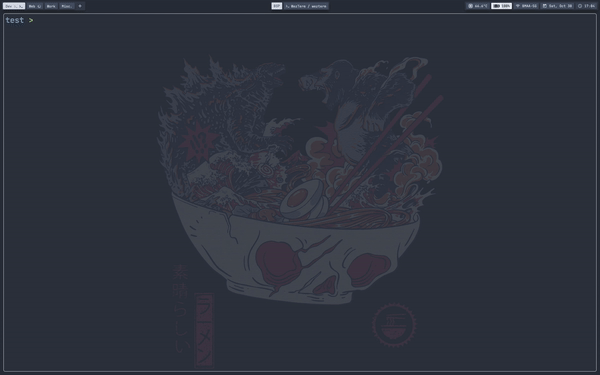

[](https://github.com/is0n/jaq-nvim/stargazers/)
[](http://makeapullrequest.com)
[](https://github.com/is0n/jaq-nvim/pulse)
[](https://github.com/is0n/jaq-nvim/issues/)
[](https://github.com/is0n/jaq-nvim/issues?q=is%3Aissue+is%3Aclosed)
[](https://github.com/is0n/jaq-nvim/graphs/contributors/)
[](https://github.com/is0n/jaq-nvim/blob/master/LICENSE)

# jaq-nvim
`jaq-nvim` is just another quickrun plugin for Neovim that's written in less than **20 lines of Lua**. Inspired by [quickrun.vim](https://github.com/D0n9X1n/quickrun.vim).

## Demo:


## Installation:
* [packer.nvim](https://github.com/wbthomason/packer.nvim):
	```lua
	use {'is0n/jaq-nvim'}
	```
* [vim-plug](https://github.com/junegunn/vim-plug):
	```vim
	Plug 'is0n/jaq-nvim'
	```
* [Vundle](https://github.com/VundleVim/Vundle.vim)
	```vim
	Plugin 'is0n/jaq-nvim'
	```
* [NeoBundle](https://github.com/Shougo/neobundle.vim)
	```vim
	NeoBundle 'is0n/jaq-nvim'
	```

## Configuration:
```lua
require('jaq-nvim').setup{
	-- Mapping used to run :Jaq
	mapping = "<Leader>r",

	-- Set to true if you want Jaq to run after :w
	run_on_save = false

	-- Put the name of the language first and then the commands you want to use
	cmds = {
		-- Example
		ruby = "!ruby %"
	}
}
```

## Usage:
You can either use the default mapping `<Leader>r` to run Jaq or simply type in `:Jaq`.

<div align="center" id="madewithlua">
	
[](#madewithlua)
	
</div>
